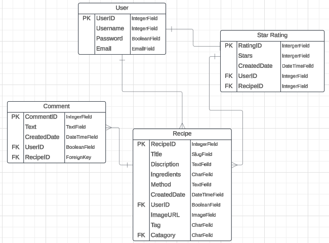
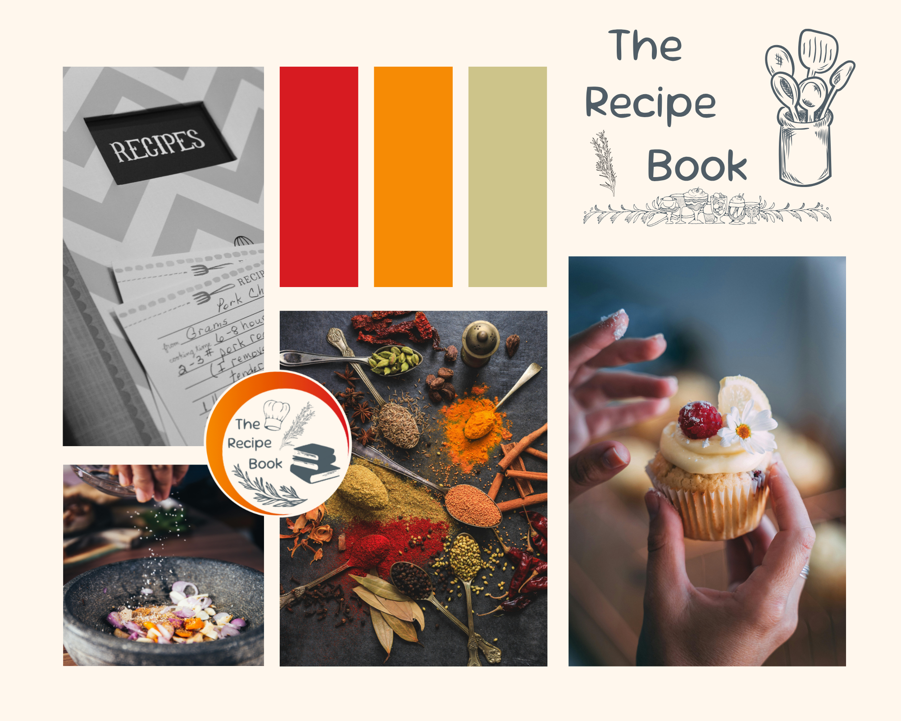
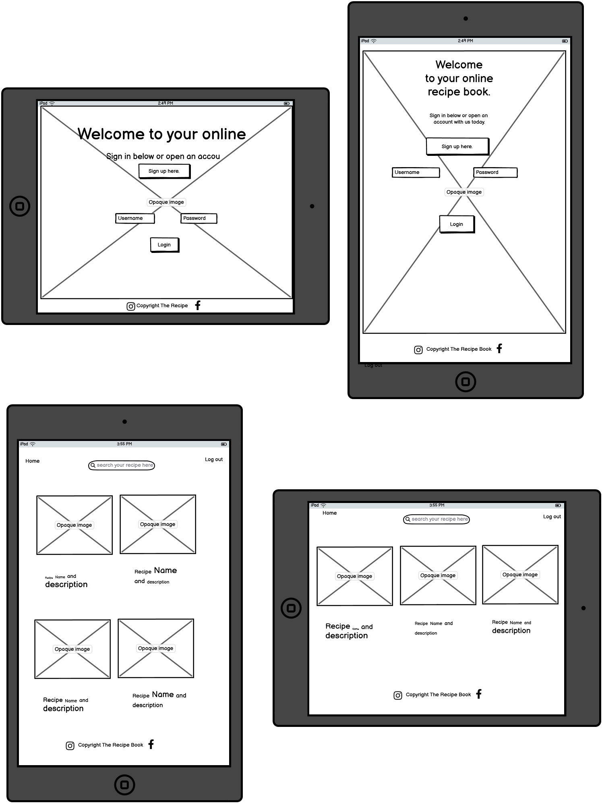

<h1 style="text-align: center;">Welcome to The Recipe Book</h1>

The ultimate hub for food lovers and home cooks! Discover a world of delicious possibilities as you swap recipes with fellow cooking enthusiasts, rate and discuss your favourite dishes, and create a personalised collection of recipes you love. Whether you're mastering the art of cooking or just exploring new flavours, The Recipe Book brings a vibrant community of foodies right to your kitchen. Let’s cook, share, and savour together.

# Table of Contents

1. [Problem Statement](#problem-statement)
2. [Purpose](#purpose)
3. [Target Audience](#target-audience)
4. [Features](#features)
5. [Additional Features](#additional-features)
6. [User Stories](#userstories)
7. [Database Structure](#database-structure)
8. [Competitor Research](#competitor-research)
9. [User Flow](#userflow)
10. [User Experience / Wireframes](#userexperience-wireframes)
11. [Agile Methodology](#agile-methodology)
12. [User Stories](#user-stories)
13. [Testing](#testing)
14. [Deployment](#deployment)
15. [Future Features](#future-features)
16. [Citation of Sources](#citation-of-sources)
17. [Known Bugs](#known-bugs)
18. [Conclusion](#conclusion)

## Problem Statement

## Purpose

## Target Audience

## Features

## Additional Features

## User Stories

## Database Structure

## Competitor Research

## User Flow

## User Experience / Wireframes

<h2 style="text-align: center;">Mood Board that inspired the website.</h2>

<h2 style="text-align: center;">Wire Frames</h2>

  
 

<h2 style="text-align: center;">Screen shots</h2>

## Agile Methodology

<h5>Kanban Board</h2>

## User Stories

| User Story | Feature |
| ----------| -------- |
| I am a user I want to be able to see the recipes clearly and be able to identify the ingredients needed | Recipe Cards with Ingredients |  
| I am a user I want to be have clear space to see and sort recipes| A space for users to store the recipes |
|I am a user I want to be able to share my own recipes for others to use| Ability to upload users own recipes and upload pictures |
| I am a user I want to be able to comment on | comment section under the recipe |
| I am a user I want to be able to rate recipes and see which are the best to try myself | A star rating feature for each recipe |
| I am a admin and I want to be able to monitor who is making comments on the recipes | login feature with username |
| As a user I want to connect to my social media to share the recipes I have created| Social Media linked to the website |

MoSCoW score features
Must Haves
<ul>
<li>1</li>
<li>2</li>
<li>3</li>
</ul> 
Should Haves
<ul>
<li>1</li>
<li>2</li>
<li>3</li>
</ul>
Could Haves
<ul>
<li>The ability to select ingredients and add to a shopping list.</li>
<li>Sort recipes and exclude those with allergens </li>
<li>Search function</li>
</ul>
Won't Haves 
<ul>
<li>The ability to select ingredients and add to a shopping list.</li>
<li>Sort recipes and exclude those with allergens </li>
<li>Search function</li>
</ul>

## Testing

## Deployment

## Future Features

## Citation of Sources

| Description | Source |
| ----------- | ------ |
| Recipe content | Chat GPT |
| Stock Image of Cupcake  | https://www.pexels.com/photo/person-holding-cupcake-with-white-icing-4099127/ | 
| Stock Image of spices | https://www.pexels.com/photo/assorted-cooking-spices-2802527/ |
| Stock Image of bowl | https://www.pexels.com/photo/person-pouring-salt-in-bowl-11
|Stock Image of recipe book | https://www.pexels.com/photo/white-and-gray-chevron-print-recipes-book-833109/|
|Logo Design | Designed using Canva |
| Fonts | Google Fonts |

## Known Bugs

## Conclusion